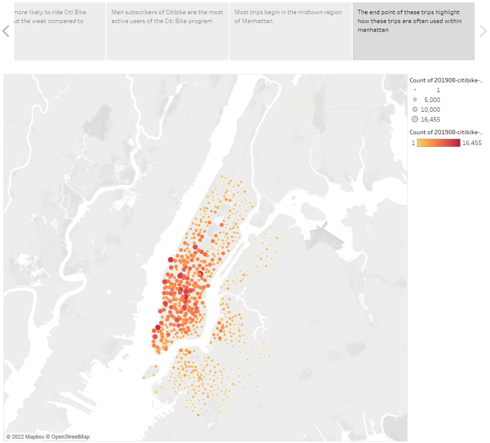

# **Citi Bike Data Analysis**

## **Overview**
This analysis leverages publicly available Citi bike data to create an exploratory analysis for Des Moines, IA bringing a bike share program to their region.

The story is visible here: [Tableau Public](https://public.tableau.com/app/profile/vincent.winting3464/viz/ModuleTableauDashboard/ChallengeStory?publish=yes)

## **Results**
Data highlighting checkout time.

Data now splitting the checkout time data by gender.

Trip density is focused around NYC commute hours.

When looking by gender, men are the more likely users of Citi bikes.

Time of day is useful but also analyzing by day of week is useful.

Using geo-spatial elements of the dataset, it is valuable to look at where the Citi bike trips begin.

And the similarity in where Citi bike trips end.

## **Summary**
This data highlights the levels of analysis that could be present for the Des Moines adoption of the Citi bike program in Iowa. 

**Future Analyses of Interest:**
- Adding in logic to the Station ID to indicate which burough the trip begins or ends in. This would allow for cross-burough analyses in the future.
- Leveraging the rider age dimension would also for a deeper analysis of the subscriber versus one-time user dimension. Understanding how the age of both segments shifts over time could have impacts on where new stations could be added.